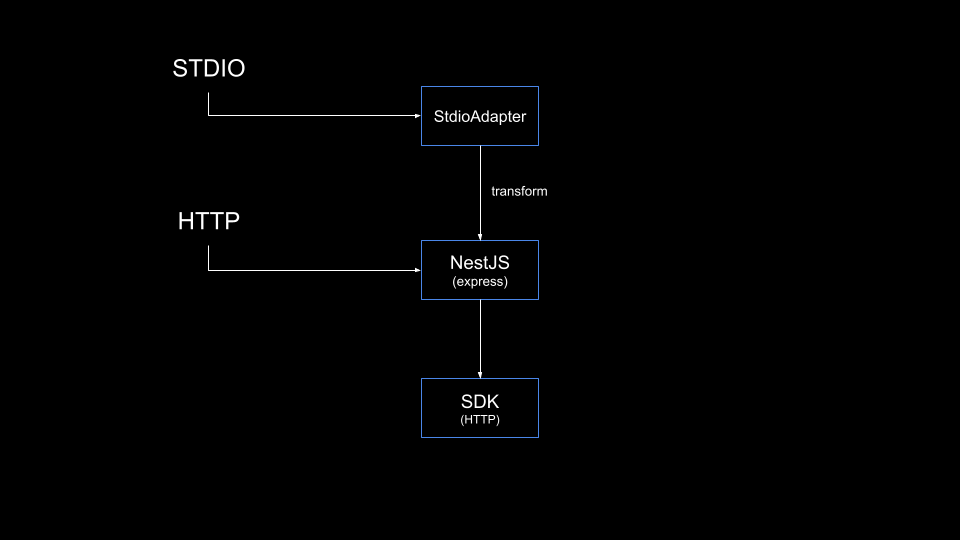

# @sowonai/nestjs-mcp-adapter


This project is a library that helps you conveniently develop NestJS MCP (Model Context Protocol) servers.
It supports both STDIO and HTTP protocols, and allows you to use all features of NestJS such as AuthGuard and Interceptor regardless of the protocol.

## Features
- **MCP Tool**: Easily create MCP tools with decorators.
- **(TOBE)MCP Resource**: Create MCP resources with decorators.
- **(TOBE)MCP Prompt**: Create MCP prompts with decorators.
- Supports both STDIO and HTTP protocols.
- Supports multiple MCP servers.

## Installation

```bash
npm install @sowonai/nest-mcp-adapter @nestjs/platform-express @modelcontextprotocol/sdk zod
```


## Simple Architecture


## Usage Example (Single Server)

This example demonstrates how to set up a single MCP server. We'll use a simple "greet" tool.

### Tool Definition (`greet.tool.ts`)

```typescript
import { Injectable } from '@nestjs/common';
import { McpTool } from '@sowonai/nest-mcp-adapter'; // Ensure this path is correct for your project
import { z } from 'zod';

@Injectable()
export class GreetToolService {
  @McpTool({
    server: 'mcp-greet', // Single server name
    name: 'helloMessage',
    description: 'Say hello to the user with a custom message.',
    input: {
      message: z.string().describe('The message to include in the greeting')
    },
    annotations: {
      title: 'Hello Message',
      readOnlyHint: true,
      desctructiveHint: false,
    }
  })
  async helloMessage({ message }: { message: string }) {
    return {
      content: [{ type: 'text', text: `Hello, ${message || 'MCP'}!` }]
    };
  }
}
```

### Controller (`mcp.controller.ts`)

This controller handles requests for the `mcp-greet` server.

```typescript
import { Controller, Post, Body, UseGuards, Req, Res, HttpCode, UseFilters } from '@nestjs/common';
import { McpHandler } from '@sowonai/nest-mcp-adapter'; // Ensure this path is correct
import { JsonRpcRequest } from '@sowonai/nest-mcp-adapter'; // Ensure this path is correct
import { AuthGuard } from './auth.guard'; // Example AuthGuard, adjust path as needed
import { JsonRpcExceptionFilter } from '@sowonai/nest-mcp-adapter'; // Ensure this path is correct
import { Request, Response } from 'express';

@Controller('mcp') // Base path for MCP requests
@UseGuards(AuthGuard)
@UseFilters(JsonRpcExceptionFilter)
export class McpGreetController { // Renamed for clarity
  constructor(
    private readonly mcpHandler: McpHandler
  ) {}

  @Post()
  @HttpCode(202)
  async handlePost(
    @Req() req: Request,
    @Res() res: Response,
    @Body() body: JsonRpcRequest,
  ) {
    const serverName = 'mcp-greet'; 
    const result = await this.mcpHandler.handleRequest(serverName, req, res, body);

    if (result === null) {
      if (!res.writableEnded) {
        return res.end();
      }
      return;
    }

    return res.json(result);
  }
}
```

### Module (`app.module.ts`)

```typescript
import { Module } from '@nestjs/common';
import { McpAdapterModule } from '@sowonai/nest-mcp-adapter'; // Ensure this path is correct
import { GreetToolService } from './greet.tool'; // Adjust path as needed
import { McpGreetController } from './mcp.controller'; // Adjust path as needed
import { AuthGuard } from './auth.guard'; // Adjust path as needed

@Module({
  imports: [
    McpAdapterModule.forRoot(), // Basic initialization
  ],
  controllers: [
    McpGreetController,
  ],
  providers: [
    GreetToolService,
    AuthGuard
  ],
})
export class AppModule {}
```

## Advanced: Multiple Servers

For applications requiring multiple MCP servers, you can define tools and resources that are available on specific servers, or on multiple servers.

### Tool Definition for Multiple Servers (`calculator.tool.ts`)

```typescript
import { Injectable } from '@nestjs/common';
import { McpTool } from '@sowonai/nest-mcp-adapter';
import { z } from 'zod';

@Injectable()
export class CalculatorToolService {
  @McpTool({
    server: ['mcp-calculator', 'mcp-other'], // Available on multiple servers
    name: 'calculate',
    description: 'Performs mathematical operations.',
    input: {
      a: z.number().describe('First number'),
      b: z.number().describe('Second number'),
      operation: z.string().describe('Operation type (add, subtract, multiply, divide)')
    },
    annotations: {
      title: 'Calculate',
      readOnlyHint: true,
      desctructiveHint: false,
    }
  })
  async calculate(params: { a: number, b: number, operation: string }) {
    const { a, b, operation } = params;
    let result: number;
    
    switch (operation) {
      case 'add':
        result = a + b;
        break;
      // ... other cases ...
      case 'divide':
        if (b === 0) {
          throw new Error('Cannot divide by zero.');
        }
        result = a / b;
        break;
      default:
        throw new Error('Unsupported operation.');
    }

    return {
      content: [{ type: 'text', text: String(result) }]
    };
  }
}
```

### Resource Definition for Multiple Servers (`users.resource.ts`)

```typescript
import { Injectable } from '@nestjs/common';
import { McpResource } from '@sowonai/nest-mcp-adapter';

@Injectable()
export class UsersResourceService {
  @McpResource({
    server: ['mcp-userinfo', 'mcp-other'], // Available on multiple servers
    uri: 'users://{userId}/profile',
    description: 'User profile information',
    mimeType: 'text/plain',
  })
  async getUserProfile({ uri, userId }: { uri: string, userId: string }) {
    return {
      contents: [{
        uri,
        text: `User ID: ${userId}\nName: Jane Doe\nPosition: Engineer`
      }]
    };
  }
}
```

### Controller for Multiple Servers (`mcp.controller.ts`)

This controller can handle requests for different MCP servers by using a URL parameter.

```typescript
import { Controller, Post, Param, Body, UseGuards, Req, Res, HttpCode, UseFilters } from '@nestjs/common';
import { McpHandler } from '@sowonai/nest-mcp-adapter';
import { JsonRpcRequest } from '@sowonai/nest-mcp-adapter';
import { AuthGuard } from './auth.guard'; // Adjust path as needed
import { JsonRpcExceptionFilter } from '@sowonai/nest-mcp-adapter';
import { Request, Response } from 'express';

@Controller('mcp') // Base path
@UseGuards(AuthGuard)
@UseFilters(JsonRpcExceptionFilter)
export class McpMultiServerController { // Renamed for clarity
  constructor(
    private readonly mcpHandler: McpHandler
  ) {}

  @Post(':serverName') // serverName parameter to route to different MCP servers
  @HttpCode(202)
  async handlePost(
    @Param('serverName') serverName: string,
    @Req() req: Request,
    @Res() res: Response,
    @Body() body: JsonRpcRequest,
  ) {
    const result = await this.mcpHandler.handleRequest(serverName, req, res, body);

    if (result === null) {
      if (!res.writableEnded) {
        return res.end();
      }
      return;
    }

    return res.json(result);
  }
}
```

### Module for Multiple Servers (`app.module.ts`)

```typescript
import { Module } from '@nestjs/common';
import { McpAdapterModule } from '@sowonai/nest-mcp-adapter';
import { AuthGuard } from './auth.guard'; // Adjust path
import { CalculatorToolService } from './calculator.tool'; // Adjust path
import { UsersResourceService } from './users.resource'; // Adjust path
import { McpMultiServerController } from './mcp.controller'; // Adjust path

@Module({
  imports: [
    McpAdapterModule.forRoot(), // Or McpAdapterModule.forRootAsync() for advanced configuration
  ],
  controllers: [
    McpMultiServerController,
  ],
  providers: [
    AuthGuard,
    CalculatorToolService,
    UsersResourceService,
  ],
})
export class AppModuleMultiServer {} // Renamed for clarity
```

## Example: Using HTTP Protocol

```typescript
import { NestFactory } from '@nestjs/core';

async function bootstrap() {
  const app = await NestFactory.create(AppModule, {
    logger: false
  });

  await app.init();
  await app.listen(3000);
}
```


## Example: Using STDIO Protocol

```typescript
import { NestFactory } from '@nestjs/core';
import { StdioExpressAdapter } from '@sowonai/nest-mcp-adapter';

async function bootstrap() {
  const adapter = new StdioExpressAdapter('/mcp/mcp-calculator');
  const app = await NestFactory.create(AppModule, adapter, {
    logger: false
  });

  await app.init();
  await app.listen(0); // Not actually bound
}
```

## Contributing

Contributions are welcome! If you'd like to contribute to this project, please submit a pull request. All contributions are appreciated.

## License

MIT
